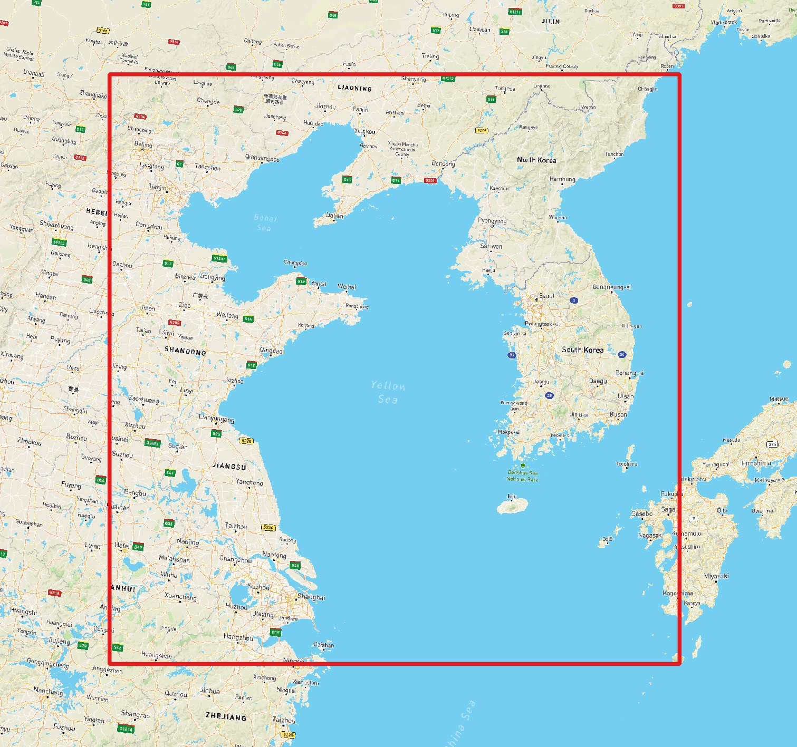

# 中韩 PM2.5 传导关系研究

> 研究区域：GOCI卫星得到的韩国、中国东北部沿海、黄海等海域
> 
> 研究时间：2019年2月底到3月中旬，短时间内密集采样[初步]

项目组成员：陈玮烨 孙克染 李岸洲 杨清杰

## 项目研究范围

##### 空间范围

空间上，本项目研究包含的地理区域如下：

* 陆地部分

  * 中国大陆
    * 浙江北部，江苏全境，安徽东部，山东大部，河北东部，北京天津全境，辽宁南部
  * 朝鲜：全域
  * 韩国：全域
  * 日本：九州岛西部

* 海洋

  * 渤海
  * 黄海
  * 东海北部
  * 日本海西部

* 地理空间范围图示

  

##### 时间范围

据媒体报道，2019年3月14日-17日在韩国境内的PM2.5浓度有明显的提升，韩国舆论认为该情况和中国大陆的空气污染相关。

故在本研究中，我们选取14日-16日的气象、空气质量等数据，对该时间范围内的中韩空气质量的传导关系进行验证。

## 项目时间表

### 数据获取  
+ [x] 区域确定，出shapefile [全体]
+ [x] 监测站：pm2.5 [李/杨]
+ 陆地海洋卫星遥感数据获取
  + [x] GOCI data [孙]
  + [x] MOD09 [杨]
+ [x] 气象数据：T, P, 风速, (RH) [陈/杨]
+ [x] 自然数据：NDVI, DEM [杨]
+ [x] AERONET [杨]

### 数据预处理  

所有数据产品的范围、投影坐标信息、尺度分辨率统一

+ **AOD**
  + [x] 反演算法DB=> AOD，裁掉海洋，和AERONET进行回归分析和校正 [李]
  + [x] 海洋：通过GOCI的AOT产品结果，与陆地进行拼接 [孙/杨]
  + [ ] AOD反演正确和精确性的验证
+ 空间全域插值气象数据T, P, 风速, (RH) 
  + [x] ArcGIS/QGIS批处理 [陈/杨]
+ 空间连接（陆地）
  + [x] 把所有自变量空间关联到PM2.5站点 [李/孙]

### 建模  
$C_{pm2.5} = f(AOD, climate, geography)$
* **Dependent Variable**
PM2.5 (地面站点 Monitored on the ground)

* **Independent Variables**
**AOD**, Elevation, Air Temperature, Sea Level Pressure, Wind Direction and Speed, Precipitations, Sky Conditions (bool variables: cloudy, sunny, rain...)

- [x] 借助工具PM2.5反演的LR和GWR试验模型

* 基于Python的机器学习的PM2.5反演试验模型
  * 回归（陆地）
    * 方法：Statictical [LR, **GWR**], Machine Learning [Random Forest, SVR…]
      * [ ] Multivariate Linear Regression (OLS) 基于最小二乘法的多元线性回归
      
        * [x] ArcGIS分析
      
        * [ ] Python Implementation (Working)
      
        * [ ] 统计检验和分析
      
          * 线性回归需要分析整体模型的线性显著性（F test）
      
          * 多重共线性检验
          * 需要对变量进行回归关系的显著性检验（t test） 
      
      * [x] GWR模型回归分析
        
        * [x] Python实现
          * 预测参数优化
            * 痴池信息准则
            * 适应性带宽
          * 回归和预测
            * 权重矩阵和数据矩阵
            * 预测分析
        
      * [ ] 对于机器学习回归模型
        - [ ] [标准化数据](https://docs.microsoft.com/en-us/azure/machine-learning/studio-module-reference/normalize-data)（有些模型要求这么做，另外就是放在统一尺度能够使算法更加高效
        - [ ] Random Forest [Python](https://towardsdatascience.com/random-forest-in-python-24d0893d51c0) (正在完成)
    
  * [ ] 回归（海洋）
    
    * 海洋AOD有缺失情况，使用*Fast Interpolation*进行补全
    * 海洋PM2.5是否需要另外的模型还需要讨论

### 模型验证与预测  
+ [ ] 模型比较验证，主要对陆地的结果进行
+ [ ] 全地表覆盖的PM2.5计算

### 分析说明  

- [ ] 可视化风场
- [ ] 分析中国的PM2.5是否对韩国产生影响
  * 稍宽时间尺度下的中韩间隔式影响